# PRD — Modeling Pengenalan Isyarat BISINDO (Skeleton MediaPipe, WL-BISINDO)

> Dokumen turunan dari `PRD.md`. Fokus: lapisan model untuk **Fitur A (Isyarat → Teks/Suara)**, dari data mentah sampai model terlatih yang bisa dipanggil lewat API dan didemokan live dengan webcam.
> Integrasi ke UI kiosk React ada di luar dokumen ini (lihat `prompt-flow-animasi-jembatan-komunikasi.md`).

---

## 1. Ringkasan

Membangun model yang menerima **urutan skeleton MediaPipe** (landmark tangan + pose) dari gerakan pengguna, lalu mengeluarkan **kata/teks** beserta **confidence terkalibrasi**. Output langsung cocok dengan kontrak kiosk:

```ts
matchSign(sequence) → { phraseId: string | null, confidence: number }
```

dan ambang keputusan PRD §10: **≥ 85% accept**, **60–84% confirm**, **< 60% tidak dikenal → Panggil JBI**.

Data training & testing **hanya dari dataset WL-BISINDO**. Tidak ada rekaman sendiri.

---

## 2. Tujuan & Non-Tujuan

**Tujuan**
- Model skeleton-based yang mengenali kosakata WL-BISINDO dan tahan terhadap penanda tangan yang belum pernah dilihat.
- Confidence yang bisa dipercaya, plus penolakan eksplisit untuk gerakan di luar kosakata.
- Artefak model siap pakai (ONNX + config), endpoint FastAPI, dan demo webcam live.

**Non-Tujuan**
- Penerjemahan BISINDO secara umum atau tingkat kalimat.
- Frasa Puskesmas di PRD §7 yang tidak ada di dataset.
- Integrasi UI kiosk, autentikasi, deployment produksi.
- Model berbasis piksel (CNN video). Model hanya melihat landmark.

---

## 3. Dataset

Lokasi: `c:\Users\Joshevan\Downloads\wl-bisindo-raw\`
- `videos/*.mp4` (1.600 file) — **dipakai**.
- `webm/*.webm` — duplikat format, tidak dipakai.
- `wl-bisindo.zip` — diperiksa untuk metadata label → kata dan lisensi.

Pola nama file: `signer{S}_label{L}_sample{N}.mp4`

| Signer | Label | Sampel per label | Total klip |
|---|---|---|---|
| signer0 | 0–11 | 10 | 120 |
| signer1 | 0–11 → 10; 12–31 → 15 | 10 / 15 | 420 |
| signer2 | 0–11 → 10; 12–31 → 15 | 10 / 15 | 420 |
| signer3 | 0–31 | 10 | 320 |
| signer4 | 0–31 | 10 | 320 |
| **Total** | **32 kelas** | | **1.600** |

**Catatan**
- signer0 tidak punya label 12–31. Ini memengaruhi desain split (§7).
- Mapping label → kata **belum diketahui**. Harus dicari di zip atau paper/README dataset. Kalau tidak ditemukan, pakai placeholder `label_00…label_31`.
- Lisensi dataset wajib dicek sebelum dipakai untuk demo/produk, termasuk untuk memutar videonya di Alur B.

---

## 4. Konsekuensi Memakai WL-BISINDO Saja

1. **Kosakata demo = label WL-BISINDO.** `phrases.mock.ts` di kiosk diisi kata dari dataset, dipilih yang paling relevan dengan skenario Puskesmas.
2. **Framing ke juri** (sejalan PRD §16):
   > "Mengenali sejumlah isyarat BISINDO tingkat kata dari dataset publik WL-BISINDO, dievaluasi pada penanda tangan yang tidak pernah dilihat model."
3. **Alur B** bisa memakai video dataset sebagai video referensi, jika lisensi mengizinkan.

---

## 5. Requirement

| ID | Requirement |
|---|---|
| R1 | Input hanya landmark MediaPipe (2 tangan + subset pose). Video tidak dikirim ke server (PRD prinsip 5). |
| R2 | Output `{ phraseId, label, confidence, action }` dengan `action ∈ accept / confirm / reject`. |
| R3 | Evaluasi utama leave-one-signer-out (LOSO). |
| R4 | Confidence terkalibrasi. Presisi pada hasil `accept` ≥ 97%. |
| R5 | Gerakan di luar kosakata (diam, fidget, kata asing) harus mayoritas ditolak. |
| R6 | Preprocessing punya satu sumber kebenaran: fungsi yang sama untuk training dan inferensi. |
| R7 | Latensi inferensi < 100 ms per sekuens di CPU (target end-to-end kiosk < 3 detik). |
| R8 | Semua angka (T, threshold, augmentasi, trimming) ada di config, tidak di-hardcode. |

---

## 6. Keputusan Desain

### 6.1 Ekstraksi landmark
- **MediaPipe Tasks**: `HandLandmarker` (2 tangan, mode VIDEO) + `PoseLandmarker`.
- Pakai file model `.task` yang sama dengan `@mediapipe/tasks-vision` di browser. Versi dipin.
- Timestamp dari fps video.

### 6.2 Pembagian kerja client vs server
- Client (kiosk / live demo) hanya mengirim **landmark mentah**.
- Semua normalisasi & fitur dikerjakan di Python. Tidak ada duplikasi logika fitur di TypeScript, jadi tidak ada risiko beda hasil.

### 6.3 Assignment tangan
- Kiri/kanan ditentukan dari **posisi terhadap pergelangan pose**, bukan label handedness MediaPipe. Label itu bisa terbalik antara video dataset dan webcam yang di-mirror.
- Field `mirrored: bool` pada sekuens untuk menangani input webcam.

### 6.4 Fitur per frame
- **Posisi global**: 2 tangan × 21 titik × (x, y, z), relatif ke tengah bahu, diskalakan dengan lebar bahu.
- **Bentuk tangan lokal**: relatif ke pergelangan, diskalakan dengan ukuran telapak.
- **Pose**: 9 titik (hidung, bahu, siku, pergelangan, pinggul).
- **Kecepatan**: delta antar-frame.
- **Mask** "tangan ada" per tangan.
- Celah deteksi ≤ 5 frame diinterpolasi.

### 6.5 Temporal
- Trimming frame diam di awal/akhir memakai logika motion yang sama dengan `useAutoCapture` kiosk, supaya klip training mirip dengan yang ditangkap kiosk.
- Resample ke **T = 48** frame (bisa dikonfigurasi, dicoba juga 32).

### 6.6 Model
| Model | Peran |
|---|---|
| DTW k-NN | Baseline & cadangan |
| **BiGRU 2 layer + attention pooling** | Kandidat utama |
| TCN / Transformer kecil | Opsional, kalau waktu ada |

Pemenang dipilih lewat **macro-F1 LOSO**.

### 6.7 Penolakan "tidak dikenal"
- Kelas tambahan **`none`** dari: segmen diam/transisi hasil trimming, gerakan sintetis, hand-dropout.
- Eksperimen **leave-labels-out**: 6 label disembunyikan saat training dan diperlakukan sebagai kata asing untuk mengukur penolakan.
- Confidence = max softmax setelah **temperature scaling**, dan ditolak juga kalau **jarak ke centroid kelas** terlalu jauh.
- Threshold accept/confirm dipilih dari sweep dengan target presisi accept ≥ 97%.

### 6.8 Gerbang kualitas
- Target **macro-F1 LOSO ≥ 0,80**.
- Kalau tidak tercapai: kosakata demo dikurangi ke kelas dengan F1 tertinggi (berdasarkan tabel F1 per kelas), cukup lewat config.

### 6.9 Environment
- Folder `Gas-JOINTS-1/ml/`. Path dataset diatur di config, video tidak disalin.
- Cache landmark di `ml/data/` (di-gitignore).
- Python 3.11, dependensi dipin: `mediapipe`, `opencv-python`, `numpy`, `pandas`, `torch`, `scikit-learn`, `onnx`, `onnxruntime`, `fastapi`, `uvicorn`, `pydantic`, `pytest`, `matplotlib`.
- CPU cukup, GPU opsional.

---

## 7. Strategi Evaluasi

| Split | Isi | Kegunaan |
|---|---|---|
| **LOSO utama** | 4 fold: signer1–4, satu signer di-hold-out per fold, 32 kelas | Pemilihan model & metrik utama |
| **Test tambahan signer0** | signer0, label 0–11 | Uji generalisasi ke signer ke-5 |
| **Leave-labels-out** | 6 label disembunyikan | Mengukur penolakan kata asing |
| Split acak | Semua data, acak | Pembanding saja (optimistis), tidak dipakai memilih model |

**Metrik**: top-1, top-3, macro-F1, F1 per kelas, confusion matrix, akurasi per signer, ECE, AUROC known vs unknown, tabel coverage (accept / confirm / reject + presisi masing-masing).

---

## 8. Arsitektur Pipeline

```mermaid
flowchart LR
  V[wl-bisindo-raw/videos mp4] --> INV[inventory → manifest.csv]
  INV --> EX[extract.py<br/>Hand+Pose Landmarker]
  EX --> NPZ[(cache .npz + QC report)]
  NPZ --> FE[features.py<br/>assign hands, normalize,<br/>trim, resample, velocity]
  FE --> DTW[DTW k-NN baseline]
  FE --> NN[BiGRU / TCN + none class]
  DTW & NN --> EV[LOSO eval + open-set<br/>+ calibration + thresholds]
  EV --> FIN[final train all signers]
  FIN --> ART[artifacts/<br/>model.onnx, label_map,<br/>feature_config, thresholds]
  ART --> API[FastAPI /match/sign]
  CAM[webcam live_demo / kiosk] -- raw landmarks JSON --> API
  API -- phraseId, label, confidence, action --> CAM
```



### Struktur folder

```
ml/
  config/          default.yaml (path, T, fitur, augmentasi, training, thresholds)
  mp_models/       hand_landmarker.task, pose_landmarker.task (dipin)
  src/bisindo/
    inventory.py  schema.py  extract.py  qc.py  visualize.py
    features.py  augment.py  dataset.py  splits.py
    models/dtw.py  models/gru.py
    train.py  evaluate.py  calibrate.py  export.py  predict.py
  api/app.py
  scripts/live_demo.py
  tests/
  artifacts/       (hasil final)
  runs/            (log eksperimen, di-gitignore)
```

---

## 9. Kontrak Data & API

### Schema frame (dipakai training, API, dan kiosk)

```ts
Frame {
  t_ms: number
  hands: { landmarks: [21][3], handedness: "Left" | "Right", score: number }[]  // 0–2 tangan
  pose: [33][4] | null   // x, y, z, visibility
}
Sequence { frames: Frame[], mirrored: boolean }
```

### `POST /match/sign`

Request: `Sequence` (JSON).

Response:
```json
{
  "phraseId": "label_07",
  "label": "<kata>",
  "confidence": 0.91,
  "action": "accept",
  "topK": [{ "phraseId": "label_07", "confidence": 0.91 }, ...]
}
```

Aturan:
- Validasi pydantic, batas jumlah frame maksimum.
- Sekuens terlalu pendek → langsung `reject` tanpa inferensi.
- Menulis log mock `matching_logs` (`direction`, `predicted_phrase_id`, `confidence`, `resulted_action`).

`GET /health` — status model & versi artefak.

> **Keamanan:** endpoint tanpa autentikasi. Aman untuk localhost/LAN kiosk, **wajib diberi auth** sebelum diekspos lebih luas.

### Artefak final (`ml/artifacts/`)

| File | Isi |
|---|---|
| `model.onnx` | Model final |
| `label_map.json` | ID kelas → kata |
| `feature_config.json` | Semua parameter preprocessing |
| `thresholds.json` | accept / confirm / jarak centroid |
| `centroids.npy` | Centroid embedding per kelas |
| `version.json` | Versi, tanggal, hash data & config |

---

## 10. Rencana Implementasi

### Task 1 — Scaffold, inventaris dataset, label map, lisensi
- **Tujuan**: proyek `ml/` bisa jalan dan manifest dataset bersih.
- **Kerja**:
  - venv, `requirements.txt` (dipin), `pyproject`, pytest, `config/default.yaml`.
  - `inventory.py`: parse nama file, baca fps/frame/durasi via OpenCV → `manifest.csv`.
  - Ekstrak `wl-bisindo.zip` ke folder sementara, cari metadata label → `label_map.json` (atau placeholder).
  - Catat lisensi dan anomali (file rusak, fps berbeda).
- **Test**: parser nama file (termasuk sample10–15), deteksi file rusak/duplikat, jumlah per signer/label sesuai tabel §3.
- **Demo**: `python -m bisindo.inventory` mencetak tabel signer × label + statistik durasi.

### Task 2 — Schema frame & ekstraksi satu video
- **Tujuan**: format landmark bersama dan ekstraksi yang benar.
- **Kerja**:
  - `schema.py` (pydantic) sesuai §9.
  - `extract.py`: Hand + Pose Landmarker mode VIDEO → `.npz` (array + mask).
  - `visualize.py`: overlay skeleton di atas video.
- **Test**: shape output, video kosong sintetis → mask tangan 0, round-trip JSON ↔ npz, timestamp monoton.
- **Demo**: MP4 overlay skeleton satu klip.

### Task 3 — Ekstraksi batch & laporan QC
- **Tujuan**: semua 1.600 klip terekstrak, kualitas terukur.
- **Kerja**:
  - Multiprocessing, resumable (skip yang sudah ada), progress bar.
  - `qc.py`: % frame dengan 0/1/2 tangan, visibilitas pose, durasi. Klip di bawah ambang → `excluded.csv`.
- **Test**: resume tidak mengulang, QC menandai fixture buruk.
- **Demo**: `qc_report.csv` + ringkasan deteksi per signer & label.

### Task 4 — Pipeline fitur & augmentasi
- **Tujuan**: fungsi murni `Sequence → [T, D] + mask`, dipakai training dan inferensi.
- **Kerja**:
  - `features.py` sesuai §6.3–6.5. Parameter dari config, disimpan ke `feature_config.json`.
  - `augment.py`: rotasi ±15°, skala 0,85–1,15, geser, time-stretch 0,8–1,2, crop awal/akhir, frame drop, noise, hand-dropout, mirror + tukar tangan (diuji via ablation).
- **Test**: invarian translasi & skala, trimming pada sinyal diam → gerak → diam, assignment tangan benar saat di-mirror, deterministik dengan seed, D konsisten.
- **Demo**: plot motion energy + titik trimming beberapa klip.

### Task 5 — Split LOSO, harness evaluasi, baseline DTW
- **Tujuan**: kerangka evaluasi jujur + model pertama yang bekerja.
- **Kerja**:
  - `splits.py` sesuai §7.
  - `evaluate.py`: semua metrik §7 → JSON + ringkasan.
  - `models/dtw.py`: DTW k-NN.
- **Test**: tidak ada kebocoran signer hold-out, DTW jarak 0 pada sekuens identik, metrik benar pada prediksi dummy.
- **Demo**: `python -m bisindo.evaluate --model dtw` → laporan LOSO.

### Task 6 — Model neural & pemilihan model
- **Tujuan**: BiGRU + attention (opsional TCN), dibandingkan dengan DTW.
- **Kerja**:
  - PyTorch, AdamW, cosine LR, early stopping, label smoothing, class weighting (10 vs 15 sampel).
  - Sweep kecil: hidden 128/192, T 32/48, mirror on/off, pose on/off.
  - Log per run + config ke `runs/`.
- **Test**: overfit satu batch kecil, shape forward pass, reproducibility dengan seed.
- **Demo**: tabel LOSO DTW vs GRU vs TCN + pemenang. Jika macro-F1 < 0,80 → usulan subset kosakata dari F1 per kelas.

### Task 7 — Kelas `none`, open-set, kalibrasi
- **Tujuan**: confidence yang layak untuk keputusan 85/60.
- **Kerja**:
  - Bangun data `none`, latih ulang dengan kelas tambahan.
  - Eksperimen leave-labels-out.
  - `calibrate.py`: temperature scaling + centroid per kelas.
  - Sweep threshold (target presisi accept ≥ 97%) → `thresholds.json`.
- **Test**: ECE turun setelah kalibrasi, `none` & label tersembunyi mayoritas di bawah threshold confirm, threshold dibaca dari file.
- **Demo**: reliability diagram, AUROC known vs unknown, tabel coverage.

### Task 8 — Training final, ekspor, laporan model
- **Tujuan**: artefak final siap pakai.
- **Kerja**:
  - Latih konfigurasi pemenang di semua signer, 3 seed. Pilih terbaik, atau ensemble rata-rata logit jika signifikan lebih baik.
  - Ekspor ONNX, bundel `artifacts/` sesuai §9.
  - Laporan model: hasil LOSO, keterbatasan, lisensi, framing.
- **Test**: paritas PyTorch vs ONNX (toleransi 1e-4), checksum artefak.
- **Demo**: folder `artifacts/` lengkap + laporan.

### Task 9 — Inferensi, FastAPI, demo webcam live
- **Tujuan**: model bisa dipanggil end-to-end dari landmark mentah.
- **Kerja**:
  - `predict.py`: `Sequence → features → ONNX → kalibrasi → response §9`.
  - `api/app.py`: `POST /match/sign`, `GET /health`, log mock.
  - `scripts/live_demo.py`: webcam → MediaPipe → auto-capture sederhana (angka dari config yang sama dengan kiosk) → API → teks + confidence di layar.
- **Test**: API via httpx (valid, payload rusak, sekuens pendek), paritas `predict` dengan hasil evaluasi, latensi < 100 ms.
- **Demo**: peragakan kata dari video dataset di depan webcam → teks + confidence muncul live; gerakan acak ditolak "tidak dikenal".

---

## 11. Kriteria Selesai

- [ ] 1.600 klip terekstrak, laporan QC tersedia.
- [ ] Laporan LOSO untuk DTW dan model neural, pemenang terdokumentasi.
- [ ] Macro-F1 LOSO ≥ 0,80, **atau** subset kosakata demo yang memenuhi target sudah ditetapkan.
- [ ] Presisi accept ≥ 97% pada data evaluasi; `none` & kata asing mayoritas ditolak.
- [ ] `artifacts/` lengkap, paritas ONNX lulus.
- [ ] `POST /match/sign` berjalan, latensi < 100 ms.
- [ ] Demo webcam live berhasil untuk kata-kata demo.
- [ ] Semua unit test lulus.

---

## 12. Risiko & Mitigasi

| Risiko | Dampak | Mitigasi |
|---|---|---|
| Mapping label → kata tidak ditemukan | Kosakata demo tidak bisa diberi nama | Cari di zip/paper; sementara pakai placeholder, isi manual dari menonton video |
| Lisensi dataset membatasi pemakaian | Tidak bisa dipakai untuk demo/Alur B | Cek di Task 1 sebelum lanjut jauh |
| Domain gap kamera dataset vs webcam kiosk | Akurasi live jauh di bawah LOSO | Normalisasi berbasis bahu, augmentasi geometri, cek live sejak Task 9; kurangi kosakata bila perlu |
| Hanya 4–5 signer | Generalisasi terbatas | Augmentasi kuat, evaluasi LOSO, framing jujur |
| Kelas mirip satu sama lain | Salah prediksi | Confusion matrix → buang/gabung kelas yang saling tertukar dari kosakata demo |
| Kosakata tingkat kata, bukan frasa Puskesmas | Relevansi demo berkurang | Pilih kata paling relevan; framing sesuai §4 |

---

## 13. Angka yang Perlu Dikalibrasi

Semua ada di `ml/config/default.yaml`:
- `T` (panjang resample): 32 / 48
- Ambang motion trimming (disamakan dengan `motionThreshold` kiosk)
- Batas interpolasi celah deteksi: 5 frame
- `thresholds.accept`, `thresholds.confirm`, `thresholds.centroid_distance`
- Temperature kalibrasi (hasil `calibrate.py`)
- Batas minimum frame untuk inferensi

---

## 14. Pertanyaan Terbuka

1. Mapping label → kata WL-BISINDO (paper/README).
2. Lisensi dataset untuk demo dan untuk memutar video di Alur B.
3. Daftar akhir kata demo yang relevan dengan skenario Puskesmas (ditentukan setelah mapping diketahui dan F1 per kelas keluar).
